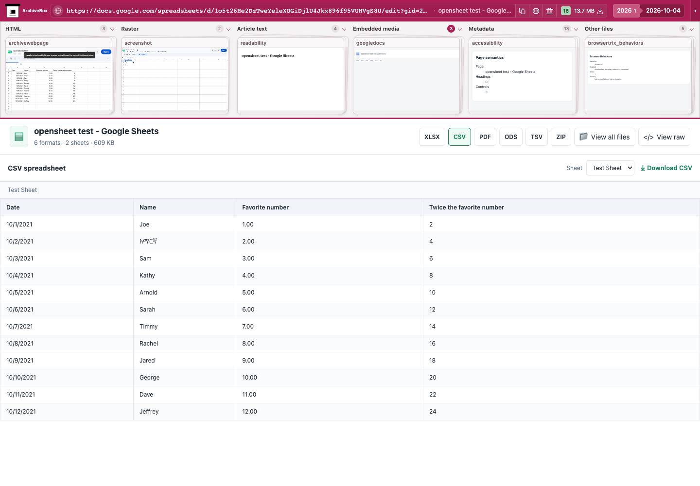
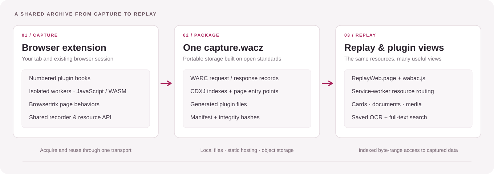
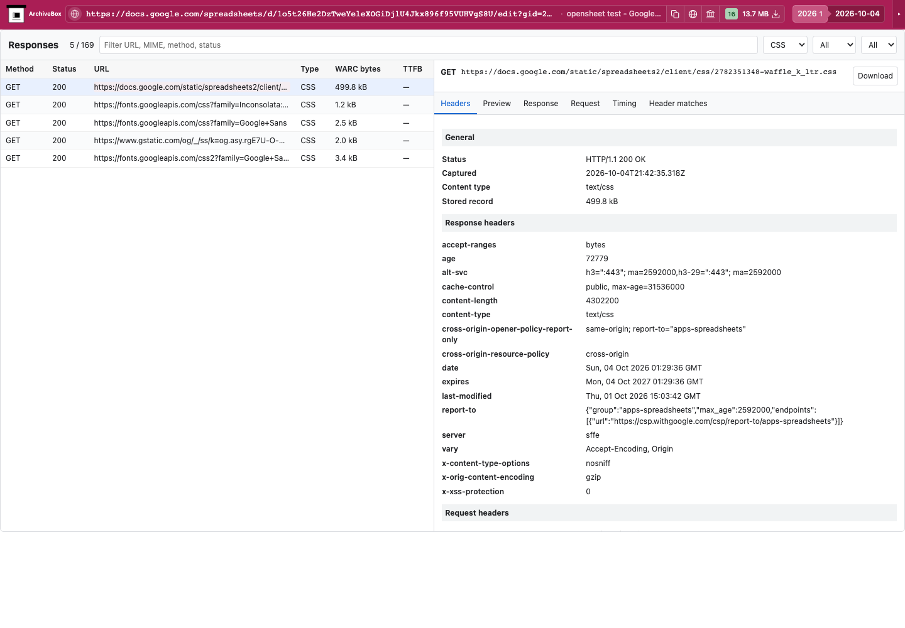
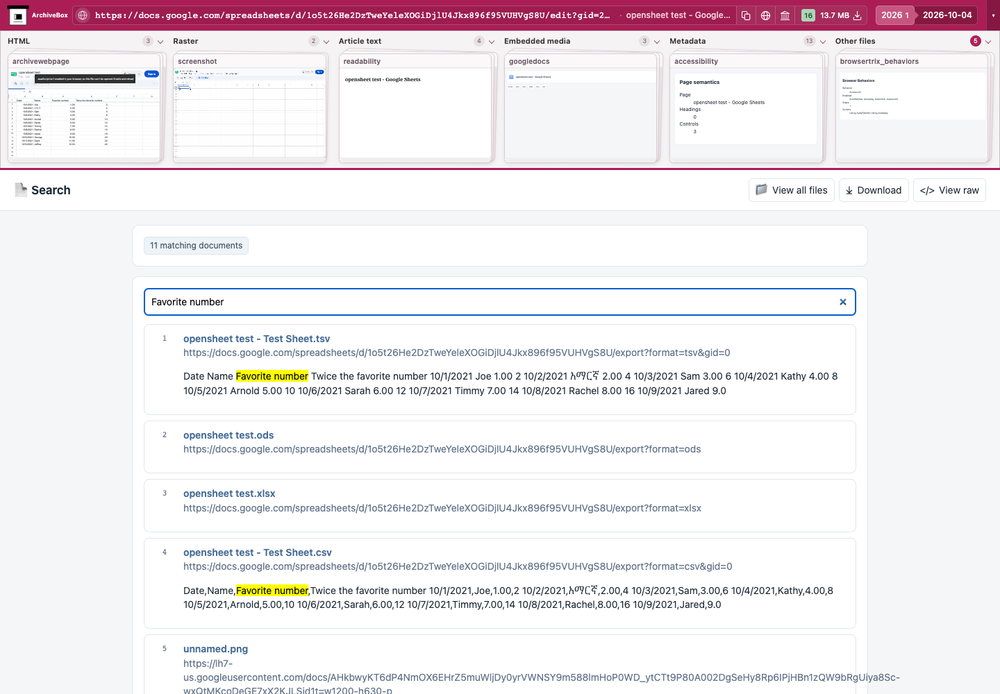
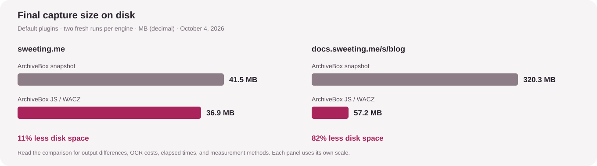

<div align="center">
  
  <h1>archivebox-js</h1>
  <p><strong>Archive the web from your browser, with one portable WACZ per capture.</strong></p>
  <p>Browser extension · Plugin hooks · Offline replay · JavaScript + WebAssembly</p>
  <p>
    <a href="#-get-started">Get started</a> ·
    <a href="#-an-archive-that-travels-between-tools">WACZ &amp; interoperability</a> ·
    <a href="#-how-it-works">Architecture</a> ·
    <a href="abx-plugins/README.md">Plugin API</a> ·
    <a href="docs/plugin-ports.md">Ports &amp; runtime details</a>
  </p>
</div>



- 🌐 **Capture in your browser**, using its existing session, rendered page, and network traffic without running an ArchiveBox server.
- 🧩 **Run coordinated plugins** for page interactions, supplemental downloads, screenshots, metadata, OCR, and search.
- 📦 **Keep one portable archive**, with shared HTTP payloads, indexed resources, and generated files organized by plugin.
- 🔎 **Explore the capture offline** through ArchiveBox's cards, document viewers, article readers, media players, and request inspector.

## 🌍 An archive that travels between tools

[WACZ](https://specs.webrecorder.net/wacz/1.1.1/) is the modern web archive packaging standard pioneered by [Webrecorder](https://webrecorder.net/). It combines **WARC records, CDX indexes, page metadata, and integrity hashes** in a single ZIP-compatible file that can be opened locally or replayed directly from a URL.

- **Efficient access over ordinary HTTP.** The ZIP directory locates archive members, CDXJ entries locate compressed WARC records, and [HTTP Range requests](https://www.rfc-editor.org/rfc/rfc9110.html#name-range-requests) retrieve the required bytes. A player can seek into a large capture while leaving the rest compressed on disk or object storage.
- **A shared indexing language.** [CDX originated at the Internet Archive; CDXJ extends it](https://pywb.readthedocs.io/en/latest/manual/indexing.html) with flexible record metadata. URL and timestamp keys connect resources to their status, MIME type, digest, and position in a WARC. These indexes can also be merged and organized across larger collections by archival tooling.
- **Portable storage and fixity.** The package carries its page entry points and SHA-256 hashes alongside the archived data. Moving a snapshot means moving one file; a compatible static host can serve it without an ArchiveBox database.
- **Preservation beyond this interface.** The original HTTP exchanges remain in [WARC 1.1](https://iipc.github.io/warc-specifications/specifications/warc-format/warc-1.1/), so another reader can interpret the archive independently of ArchiveBox's plugin views.

ArchiveBox's main application organizes a collection around its database and snapshot directories. Here, the **WACZ is the portable unit of storage and replay**, and the UI is a reader over that shared archive. This places the capture directly in the wider web archiving ecosystem:

| Tool or ecosystem | How it connects |
| --- | --- |
| [ArchiveWeb.page](https://github.com/webrecorder/archiveweb.page) | Its recorder and exporter provide the capture foundation, extended with ArchiveBox's hook lifecycle and plugin artifacts. |
| [Browsertrix](https://github.com/webrecorder/browsertrix-crawler) | Uses the same WACZ ecosystem; its [behavior library](https://github.com/webrecorder/browsertrix-behaviors) supplies page interactions during capture. |
| [ReplayWeb.page](https://github.com/webrecorder/replayweb.page) and [wabac.js](https://github.com/webrecorder/wabac.js) | Their replay component and service worker load archived pages and resources from the WACZ. |
| [warcio.js](https://github.com/webrecorder/warcio.js) and [warcio](https://github.com/webrecorder/warcio) | Standard WARC streams can be read, inspected, and processed in JavaScript or Python. |
| [pywb](https://github.com/webrecorder/pywb) and [Internet Archive tooling](https://github.com/internetarchive/warctools) | The underlying WARC records and CDX/CDXJ indexing model connect to established replay and preservation workflows; WARC members can be extracted for those tools. |

ArchiveBox-specific plugin metadata and files extend the package alongside its standard archive members. Other WACZ readers use the web archive layer; this player adds the plugin cards and derived views.

## 🧭 How it works



1. **Capture and interact.** Numbered hooks run in isolated workers, while Browsertrix behaviors and page hooks scroll, expand, and collect content through the shared browser recorder.
2. **Acquire once and reuse.** Plugins request resources through the capture API. It reuses compatible recorded exchanges and fetches missing resources into the same archive; WARC revisit records preserve distinct exchanges while sharing identical bodies.
3. **Finish processing before export.** After acquisition drains, document parsing and OCR feed the saved full-text search index. The exporter packages the capture, records its hashes, and verifies it before removing temporary capture storage.
4. **Read through replay.** The service worker serves original resources, and plugin viewers derive their presentations from those resources or read saved observations. Lightweight card previews and full viewers have separate entry points.

<details>
<summary><strong>Inside a capture.wacz</strong></summary>

```text
capture.wacz
├── archive/                  Original HTTP exchanges in compressed WARC
├── indexes/                  CDXJ resource indexes and index-block lookup
├── pages/pages.jsonl         Page URLs, timestamps, and titles
├── datapackage.json          File inventory, hashes, and plugin metadata
├── datapackage-digest.json   Package manifest digest
├── screenshot/               Generated screenshots
├── consolelog/               Captured browser observations
├── liteparse/                Extracted text and OCR layout
└── search_contents/          Full-text search index
```

- Bytes returned by servers—including PDFs, Office exports, subtitles, and media—belong in the shared WARC.
- Unique generated outputs belong in plugin folders; derived readers and reports can be built when opened.
- Plugins work with resource references through `fetch`, `read`, and `addResource`. The archive layer owns deduplication, record locations, range reads, and replay URLs.

</details>

<table>
<tr>
<td width="50%"></td>
<td width="50%"></td>
</tr>
<tr>
<td align="center"><sub>Inspect the original requests and responses</sub></td>
<td align="center"><sub>Search documents, response text, and saved OCR</sub></td>
</tr>
</table>

## 🧩 Where it fits in ArchiveBox

| Repository | Role | Execution and storage |
| --- | --- | --- |
| **[archivebox-js](https://github.com/ArchiveBox/archivebox-js)** | Browser capture engine and snapshot player | JavaScript workers and WASM runtimes; one WACZ per capture |
| **[abx-dl](https://github.com/ArchiveBox/abx-dl)** | Standalone downloader CLI and orchestration library | Native processes, executable plugin hooks, snapshot folders, and output manifests |
| **[abx-plugins](https://github.com/ArchiveBox/abx-plugins)** | Shared extraction tools, configuration, and presentation templates | Multi-language hooks and plugin-owned output formats |
| **[ArchiveBox](https://github.com/ArchiveBox/ArchiveBox)** | Collection management, scheduling, web UI, and APIs | Python/Django, a collection database, and the downloader/plugin ecosystem |

The browser approach brings several practical benefits:

- **A shared browser and transport** give plugins access to the same session and recorded resources, reducing repeated downloads and per-tool resource copies.
- **Browser-managed execution** replaces native process setup with bundled workers and WASM engines. Existing Python extractors also run through Pyodide, using the same recorder-backed transport.
- **A portable replay boundary** lets captures move between local storage, static hosting, and archival tools while viewers evolve independently.
- **A familiar plugin model** retains numeric ordering, foreground/background hooks, readiness gates, timeouts, graceful shutdown, and worker termination. Existing ArchiveBox templates supply the output hierarchy and presentation.

The local [browser plugin tree](abx-plugins/README.md) contains capture hooks and view modules that WXT bundles into the extension. The [typed hook API](src/capture/types.ts) keeps plugin behavior separate from archive storage and replay mechanics.

For individual engines, see **[Plugin ports and browser runtime](docs/plugin-ports.md)**: Pyodide and WASM integrations, native JavaScript ports, upstream packages, supported output types, and browser-specific limits.

### 📊 Capture measurements



The [default-capture comparison](docs/benchmarks.md) covers both `sweeting.me` and `docs.sweeting.me/s/blog`, with elapsed time, CPU, RAM, disk activity, network observations, and output coverage. The blog WACZ occupies about **82% less disk space**; its capture takes longer because the browser suite also performs OCR on 77 images. The media-heavy `sweeting.me` capture saves about **11%**. Measurements use two fresh runs per engine and preserve each tool's defaults.

## 🚀 Get started

**Requirements:** Node.js 22.12+, pnpm 10, and a desktop Chromium browser such as Chrome or Brave.

```sh
git clone https://github.com/ArchiveBox/archivebox-js.git
cd archivebox-js
pnpm install --frozen-lockfile
pnpm build
```

1. Open `chrome://extensions` or `brave://extensions`, enable **Developer mode**, and choose **Load unpacked**.
2. Select `.output/chrome-mv3`, then open **ArchiveBox JS** from the extension toolbar.
3. Choose a tab or URL and start a capture. All bundled plugins are enabled by default and run when applicable.
4. Open the saved snapshot or download its WACZ. Use **Import WACZ** to reopen a saved archive.

<details>
<summary><strong>Run the standalone replay UI</strong></summary>

```sh
pnpm build:player
pnpm exec vite preview --config vite.player.config.ts --port 8736
```

Open `http://localhost:8736` and select a WACZ, or pass its URL as the `source` query parameter. Remote files need a host that supports byte ranges and CORS. The HTTP player supports interactive archived JavaScript through Webrecorder; extension replay keeps archived scripts disabled within the extension's security boundary.

</details>

<details>
<summary><strong>Development</strong></summary>

```sh
pnpm dev             # WXT development build
pnpm compile         # TypeScript checks
pnpm test:live       # Build and run browser capture/replay tests
```

Live tests use Chromium, public websites, exported WACZ files, and offline replay. Install the test browser with `pnpm exec playwright install chromium` before running them. Test artifacts are written outside the checkout.

</details>

## 💜 Built with the web archiving community

- **[Webrecorder](https://webrecorder.net/)** provides ArchiveWeb.page, ReplayWeb.page, wabac.js, warcio, Browsertrix behaviors, and the WACZ specification at the center of this project.
- **[ArchiveBox and abx-plugins](https://github.com/ArchiveBox)** provide the plugin conventions, capture behaviors, snapshot organization, and viewer templates.
- **[WXT](https://wxt.dev/), [Pyodide](https://pyodide.org/), [SingleFile](https://github.com/gildas-lormeau/SingleFile), and the bundled extraction engines** supply the browser tooling, runtimes, and content processing. Source versions, licenses, and integration details live in [`vendor/`](vendor/) and [`patches/`](patches/README.md).

[AGPL-3.0-or-later](LICENSE). Vendored components retain their own license notices, including the original browser extension's [MIT notice](LICENSES/archivebox-browser-extension-MIT.txt). See [local data handling](PRIVACY.md) for capture storage and privacy details.
