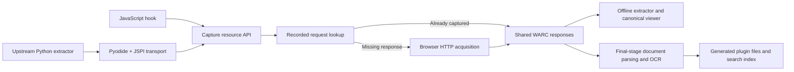

# Plugin ports and browser runtime

[Architecture and installation](../README.md) · [Hook API](../abx-plugins/README.md)

The extension bundles JavaScript plugins and upstream engines compiled for WebAssembly. Python extractors run inside Pyodide without a local Python installation or an ArchiveBox server. Browser transport, memory, sandbox, and execution limits still differ from native processes.

## Shared execution and storage

- **Lifecycle:** the runner owns numeric ordering, foreground/background hooks, readiness gates, dependency waits, deadlines, cooperative cancellation, and worker termination. Page hooks share an isolated DOM world without relying on page JavaScript globals.
- **Transport:** plugins call `archive.fetch`, `archive.read`, and `archive.addResource`. The shared layer owns request matching, response recording, deduplication, WARC/CDX locations, and range reads. Methods, bodies, credential-sensitive headers, ranges, and `Vary` affect reuse.
- **Python networking:** [Pyodide 0.29.3](https://pyodide.org/) and [JSPI](https://blog.pyodide.org/posts/jspi/) suspend synchronous Python while JavaScript awaits recorder I/O. Requests uses its public adapter interface; yt-dlp uses its request-handler interface. Site parsers remain upstream code.
- **Replay:** transport resolves recorded requests only. Opening a reader never fetches missing responses from the original server. Expensive extractors run in isolated workers; cards use indexes and lightweight summaries.
- **Storage:** verbatim server bytes stay in WARC, including PDFs, fragments, subtitles, cloud downloads, and Office exports. Generated observations, screenshots, OCR results, and search indexes belong in plugin folders. DOM, SingleFile, articles, forum/gallery metadata, accessibility reports, and printed PDFs are derived when opened.

## Pyodide and WASM engines

| Plugin | Bundled engine | Integration and output | Runtime boundaries |
| --- | --- | --- | --- |
| **yt-dlp** | [yt-dlp 2026.8.19](https://github.com/yt-dlp/yt-dlp), yt-dlp-ejs 0.8.0, Pyodide | Original extractor corpus; recorder-backed `RequestHandler`; manual and automatic subtitle languages; original media, artwork, HLS/DASH dependencies | No native sockets, TLS impersonation, RTMP, WebSockets, DRM, or arbitrary subprocesses. Request/byte/playlist budgets apply. |
| **Media assembly** | [FFmpeg.wasm](https://github.com/ffmpegwasm/ffmpeg.wasm), wrapper 0.12.15 / core 0.12.10 | Archived audio/video and supported fragments merge on demand with codec copy; a transient result serves playback and download. | No general native FFmpeg postprocessor suite. Browser-memory limits apply; byte-ranged extractor fragments are unsupported. |
| **forum-dl** | [forum-dl 0.3.0](https://github.com/mikwielgus/forum-dl), Pyodide, lxml, regex, Pydantic | All eleven upstream forum/mailing-list module families; original traversal and writer model feed the canonical template. | Upstream selector bugs, authentication, unavailable attachments, and access challenges remain. Native mailbox output/resume is outside the adapter. |
| **gallery-dl** | [gallery-dl 1.32.15](https://github.com/mikf/gallery-dl), Pyodide | Complete distribution: 306 extractor modules, 1,034 classes; recursive `DataJob` resolves original files through the recorder. | No external downloaders, native postprocessors, interactive OAuth callback servers, or optional native modules. Registered classes are not verified-site counts. |
| **papers-dl** | papers-dl 0.0.25, pdf2doi 1.5.1, Pyodide, [MuPDF.js 1.28.1](https://mupdf.readthedocs.io/en/latest/mupdf-js.html) | Original identifier logic, providers, PDF validation and title inference; MuPDF WASM supplies structured text at the native binding boundary. | Upstream provider availability/parsing errors remain. PDF metadata rewriting is disabled to preserve original bytes. |
| **LiteParse / OCR** | [LiteParse WASM 2.15.1](https://github.com/run-llama/liteparse/tree/main/packages/wasm), [PaddleOCR.js 0.4.2](https://github.com/PaddlePaddle/PaddleOCR/tree/main/paddleocr-js), PP-OCRv5 mobile, ONNX Runtime Web | Final-stage PDF text/layout and image OCR; saved JSON feeds the viewer and search index. | Model vocabulary and browser image decoding define coverage. No VLM/handwriting backend, Office-to-PDF conversion, or native OCR backend selection. |

### yt-dlp

- [dlPro](https://github.com/machineonamission/dlPro) informed the browser-runtime investigation. Its application source is not embedded; this adapter uses upstream extension points and the shared recorder.
- EJS executes packaged solver code in an opaque network-disabled sandbox through upstream's provider interface. Actual challenge-solving coverage is separate from provider registration.
- The default format selector is `bv*+ba/b`, with limits of 256 MiB, 1,000 requests, and 20 playlist entries. Each manual and automatic language group selects its preferred original subtitle representation; fetching every representation is optional.
- FFmpeg receives local files only, with `file,concat` protocols. It does not fetch from the original site or store a second merged movie in WACZ. Cards never load FFmpeg.
- Native best-quality selection can exceed browser budgets. Real YouTube subtitle acquisition encountered HTTP 429, so complete acquisition of every translated language is not established.

[Package hashes, source adaptations, and real-site results](../vendor/yt-dlp/NOTICE.md)

### Forum, gallery, and papers

- Forum and gallery acquisition perform recorded-only reconstruction before success: the upstream engine must reproduce the selected model/file inventory using captured responses.
- Forum source patches fix specific HN caching, Discourse traversal, Hypermail date, and phpBB detection issues. They are explicit build patches, without replacement site parsers. [Source and patches](../vendor/forum-dl/NOTICE.md)
- Gallery retains recursive dispatch, configuration, predicates, metadata serialization, and Requests sessions. Its canonical viewer receives transient metadata and replay URLs. [Adapter and verified cases](../vendor/gallery-dl/README.md)
- Papers uses real pdf2doi dependencies, including Pyodide cryptography. MuPDF spans replace native `fitz` access while retaining the title algorithm; original PDFs remain unchanged. [Dependency manifest and adaptations](../vendor/papers-dl/PROVENANCE.md)
- Packaged source archives use `.tgz` filenames where necessary while retaining their original hashes, avoiding static servers treating `.gz` as transport compression before runtime verification.

### Document extraction and search

- LiteParse runs after acquisition and background observers drain. It processes original PDFs/images, deduplicates inputs by digest, and examines supported members inside ZIP, EPUB, and Office packages. Generated screenshots and browser-printed PDFs are excluded.
- Defaults are 100 source files, 1,000 PDF pages, 150 DPI, and a 180-second hook budget. Tiny-image filters and nested-archive depth/expanded-byte limits bound work.
- [OfficeParser](https://github.com/harshankur/officeParser) extracts supported Office text. Original HTML/text, subtitles, cloud exports, archive members, and saved OCR feed `search_contents` through [MiniSearch](https://github.com/lucaong/minisearch).
- Readability and forum presentations remain derived; original response text is indexed without storing another article/thread copy. OCR JSON retains text/layout once, and search stores its index and source references.
- Generated OCR bindings run in a disposable sandbox without extension APIs. Models and interpreter assets are bundled. Viewers read saved results and never start OCR.

[Models and licenses](../vendor/ocr/NOTICE.md) · [LiteParse details](../abx-plugins/abx_plugins/plugins/liteparse/README.md)

## JavaScript source ports and libraries

| Area | Implementation and adaptation |
| --- | --- |
| **Google Workspace** | Canonical hooks and templates; original exports use the document's browser session. Sheets discovers individual sheets for CSV/TSV and opens its CSV table by default. [Formats and limits](../abx-plugins/abx_plugins/plugins/googledocs/README.md) |
| **Google Drive / Dropbox** | Canonical folder/download interactions; the recorder consumes the actual browser attachment once. Provider ZIPs remain original responses, with shared member references for exploration, OCR, and search. [Port details](../vendor/archivebox/plugins/gdrive/PROVENANCE.md) |
| **Git** | [isomorphic-git](https://isomorphic-git.org/) and memfs implement smart HTTP, shallow branches, recursive submodules, and recorded-only reconstruction. Download checkout builds a transient ZIP with `.git`, modes, and symlinks. [Details](../vendor/git/NOTICE.md) |
| **SingleFile** | The real [single-file-core](https://github.com/gildas-lormeau/single-file-core) engine inlines assets from replay. The generated HTML serves the open view/download; cheap cards do not run the engine. [Details](../vendor/singlefile/NOTICE.md) |
| **Article readers** | Mozilla Readability, Postlight Mercury, and Defuddle derive content and populate canonical templates. Images retain dimensions and replay URLs. |
| **Browser behaviors** | Full [Browsertrix Behaviors](https://github.com/webrecorder/browsertrix-behaviors) corpus, recorder-backed autofetch, cancellation, and a 30-second default budget. [Adaptations](../vendor/browsertrix-behaviors/NOTICE.md) |
| **Modal closer / scrolling** | Canonical selectors, isolated-world DOM actions, CDP dialogs, bounded scrolling, and saved interaction measurements. [Modal closer](../abx-plugins/abx_plugins/plugins/modalcloser/README.md) · [Scrolling](../abx-plugins/abx_plugins/plugins/infiniscroll/README.md) |
| **Metadata / responses** | Canonical templates read the shared archive. DNS/TLS observations are captured when needed; headers, redirects, hashes, SEO, and responses do not require another response-file tree. |
| **PDF / accessibility** | Chromium APIs render archived resources on demand. These operations require the extension or the local preview server's Chromium renderer; a static host alone cannot provide them. |

HTTP replay uses ReplayWeb.page and wabac. Extension replay disables archived scripts; the separate HTTP player supports interactive Webrecorder replay. [Local Webrecorder and SingleFile patches](../patches/README.md) document the integration changes.

## Coverage relative to native ArchiveBox

The browser registry has **48 enabled-by-default namespaces**, including presentation aliases and derivation-only plugins. This is not a count of independent engines or files produced for every URL.

- **Represented outputs:** web replay, screenshots, DOM/SingleFile/PDF, article readers, metadata, requests, forum/gallery/media/paper viewers, cloud documents, Git, OCR, and search.
- **Collection infrastructure differs:** local `search_contents` replaces the snapshot search experience; server SQLite/Sonic/ripgrep services, scheduling, and collection management remain ArchiveBox responsibilities.
- **Native integrations absent here:** OpenDataLoader, Trafilatura, OpenTimestamps, TLSNotary, native AI-agent plugins, external captcha services, separate ad-blocker extensions, MHTML, and archivedotorg submission have no bundled browser equivalent.
- **OpenDataLoader:** the canonical plugin needs `opendataloader-pdf`, Java 11+, and optionally a hybrid OCR service. This repo has no JVM/native-stack port. Pyodide cannot make arbitrary native/JVM dependencies available. [Upstream](https://github.com/opendataloader-project/opendataloader-pdf) · [Canonical configuration](https://github.com/ArchiveBox/abx-plugins/tree/main/abx_plugins/plugins/opendataloader)
- **Output timing differs:** native folders often contain generated HTML, reports, and media assemblies immediately. Here some outputs are derived when opened, while OCR and search indexing finish during capture. Storage and capture-time comparisons need to account for that distinction.

Captures retain hook outcomes and diagnostics. An enabled plugin can be inapplicable, and a budget or upstream error can leave partial output. [Live tests](../tests/) exercise real sites and offline replay; provenance documents distinguish bundled coverage from completed acceptance cases.
